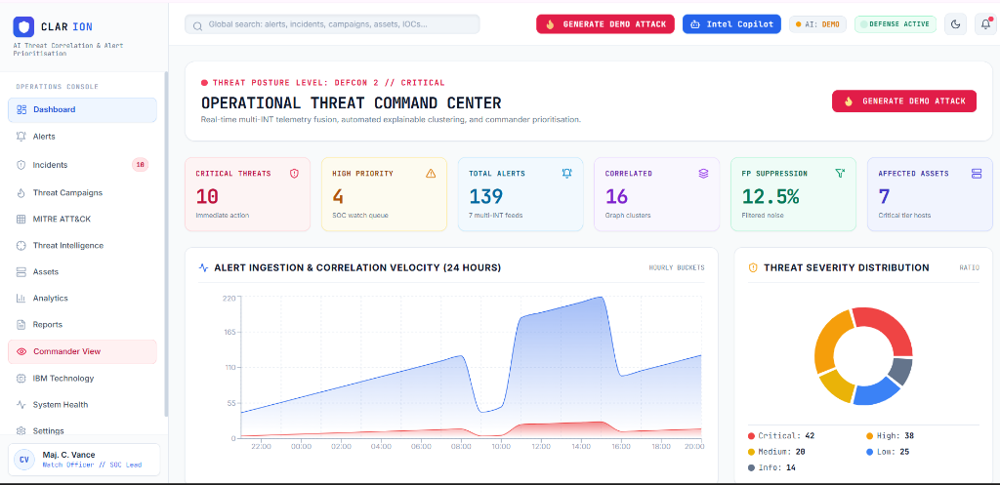
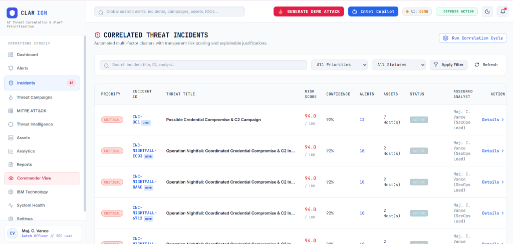
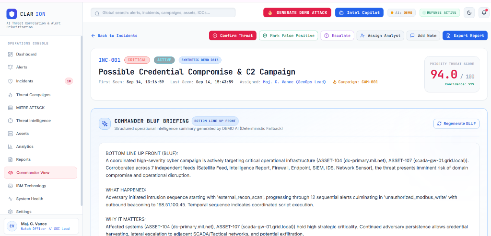

# CLARION Operational Screenshots

This directory contains live screenshots of the running **CLARION** cyber defense platform.

---

### 1. Operational Threat Command Center (`01-home-dashboard.png`)

- **What it shows:** Executive watch floor telemetry displaying real-time KPIs (10 Critical Threats, 4 High Priority, 139 Total Alerts, 16 Correlated clusters, 12.5% FP Suppression, 7 Affected Assets).
- **Features Demonstrated:** Ingestion velocity chart over a 24-hour sliding window, threat severity distribution donut breakdown, live DEFCON 2 threat posture banner, and quick-action buttons ("Generate Demo Attack", "Intel Copilot").

---

### 2. Correlated Threat Incidents Table (`02-correlated-incidents.png`)

- **What it shows:** Automated multi-factor incident clusters generated by the sliding-window Union-Find engine.
- **Features Demonstrated:** Consolidated view of incidents (e.g., `INC-001` Possible Credential Compromise & C2 Campaign) with explainable priority tags, risk scores ($94.0/100$), confidence percentages ($92\%$), correlated alert counts, affected host counts, and assigned analyst assignments.

---

### 3. Incident Investigation & Commander BLUF Briefing (`03-incident-bluf-briefing.png`)

- **What it shows:** Comprehensive incident dossier with an executive **Bottom-Line-Up-Front (BLUF)** briefing generated by the grounded AI analyst engine.
- **Features Demonstrated:** Priority threat gauge ($94.0/100$), multi-INT corroboration across 7 independent feeds, structured operational narrative ("Bottom Line Up Front", "What Happened", "Why It Matters"), action directives, and export report capabilities.
