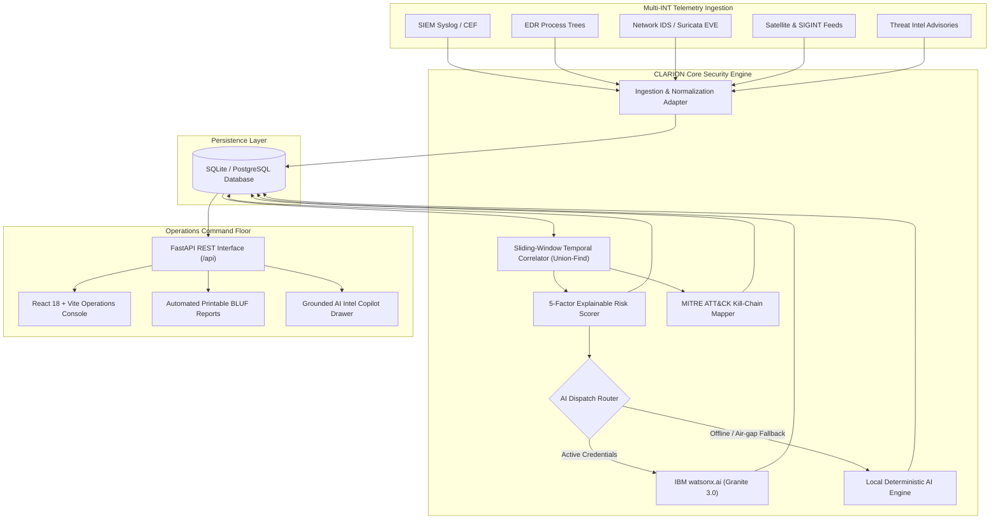

# Architecture: CLARION

## System Architecture

CLARION is architected as an asynchronous, modular threat correlation and AI intelligence platform decoupling high-throughput ingestion from stateful graph correlation, explainable scoring, and LLM inference.

## Components

| Component | Technology | Responsibility |
|---|---|---|
| **Operations Console** | React 18, Vite, TypeScript, Tailwind CSS | High-contrast executive White/Dark command center, interactive MITRE matrix, alert timelines, and Copilot modal. |
| **Backend API Server** | FastAPI, Pydantic v2, Python 3.11+ | REST endpoints, request validation, authentication routing, and background lifecycle orchestration. |
| **Normalization Engine** | Python Ingestion Adapters | Parses heterogeneous SIEM, EDR, Suricata, and RF logs into a canonical Alert schema with UTC timestamps. |
| **Correlation Engine** | Disjoint-Set Union-Find Algorithm | Graph-based clustering linking alerts by asset ID, IP, user, and temporal proximity ($\Delta t \le 30\text{m}$). |
| **Risk Scoring Engine** | Mathematical Decomposition Service | Computes explainable 0–100 risk score factoring Severity, Asset Criticality, Correlation, Confidence, and Impact. |
| **AI Decision Engine** | IBM watsonx.ai (`ibm/granite-3-8b-instruct`) | Generates Bottom-Line-Up-Front (BLUF) briefings, commander action directives, and answers natural language analyst queries. |
| **Offline AI Engine** | Deterministic Grounded Engine | 100% air-gap fallback providing exact, unhallucinated threat summaries when external cloud APIs are unreachable. |
| **Persistence Layer** | SQLAlchemy 2.0 + SQLite / PostgreSQL | Relational storage for normalized alerts, correlated incidents, assets, threat indicators, and generated intelligence reports. |

## Data Flow

1. **Ingest & Normalize:** Raw alert records arrive via HTTP POST or batch feed. Ingestion adapters extract IPs, hostnames, timestamps, and MITRE indicators into canonical database records.
2. **Cluster & Correlate:** The sliding-window correlator evaluates active alerts against open incident clusters. New alerts matching existing entity anchors (e.g. `ASSET-104` or `198.51.100.45`) are added to the corresponding incident graph.
3. **Score & Classify:** The 5-factor scoring engine calculates the updated risk score and assigns operational priority (`CRITICAL`, `HIGH`, `MEDIUM`, `LOW`).
4. **Enrich with MITRE ATT&CK:** Identified technique IDs (`T1078`, `T1059`, `T1003`, etc.) are mapped to enterprise ATT&CK tactics to assess kill-chain maturity.
5. **Generate BLUF Briefing:** When requested by an analyst or commander, telemetry is dispatched to IBM watsonx.ai Granite 3.0 to generate a concise, structured BLUF dossier.
6. **Command Presentation:** The React operations console streams live metrics, renders risk gauges, displays attack timelines, and provides 1-click printable PDF intelligence reports.

## Security Considerations
- **Zero Hardcoded Secrets:** Credentials (IBM Cloud API keys, project IDs, database passwords) are loaded strictly via environment variables and excluded by `.gitignore`.
- **Offline Reliability:** No mandatory external outbound network calls; systems remain fully functional even in secure, air-gapped defense enclaves.
- **Input Sanitization:** All incoming payloads are strictly validated against typed Pydantic v2 schemas before database insertion.

## Scalability Notes
- The FastAPI backend is completely stateless; multiple backend instances can run behind an Nginx or Kubernetes load balancer.
- Union-Find correlation operates in nearly linear time $\mathcal{O}(N \cdot \alpha(N))$, easily processing thousands of alerts per minute without query latency.
